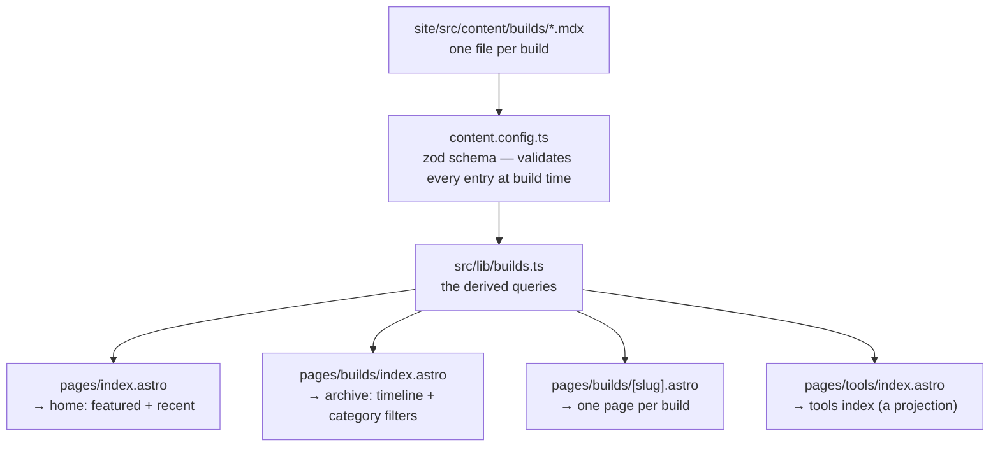

# Architecture — one collection, four views

The whole claim of build #1 is that **adding a build log is adding one markdown file**,
not editing four pages. This is how that works, taken from the running code.

## The shape



Four views, one source. No page reads a second source of truth, so there is no view that
can silently disagree with another.

## Why the tools index is a *projection*, not a second list

There is no `tools` collection. `/tools` is derived from the same `builds` entries: the
`tool`, `tool_summary`, `tool_verdict` and `accessibility` fields live **on the build**,
and `src/lib/builds.ts` groups by `tool`. When several builds share one tool, the
most-recent build's `tool_*` values win.

That's the load-bearing decision. A separate tools list would be a second place to update
and a second place to go stale — a tool's verdict would eventually contradict the build it
came from. Deriving it means the verdict is always attached to the evidence that produced it.

## The one invariant worth protecting

> Adding a build must mean adding one markdown entry — never touching page code.

It is measurable, and it was measured rather than assumed (see `../test.md`, check 4): a
throwaway entry was added with a different category, a different tool, `runs_on_site:
false` and `status: recheck-due`; it appeared on the home page, the archive and `/tools`
and generated its own detail route with **zero page-code changes**; then it was deleted.

To re-run that check yourself:

```bash
# add a temporary entry, build, and confirm it appears in all four outputs
npm --prefix site run build
grep -rl "Your Temp Title" site/dist/index.html site/dist/builds/index.html site/dist/tools/index.html
```

## Where the per-build variability lives

Frontmatter stays flat and boring (it mirrors `builds/_template/meta.yaml`). Anything
richer — the honest-process steps, stat tiles, the verdict card — is composed in the MDX
**body** from a reusable kit in `site/src/components/post/`, so a new build is *written*,
not *designed*. See that directory's `README.md` for the component contract.

## Freshness is data, not prose

`status` (`draft | verified | recheck-due | archived`) and the dated stamp render straight
from frontmatter, so a build's currency is a field you update in one place rather than a
sentence you have to remember to rewrite. `draft` is also a real gate — `src/lib/builds.ts`
filters drafts out in production builds only:

```ts
import.meta.env.PROD ? data.status !== 'draft' : true
```

so an unfinished entry can live in the repo and be visible in `npm run dev` without being
publishable.
